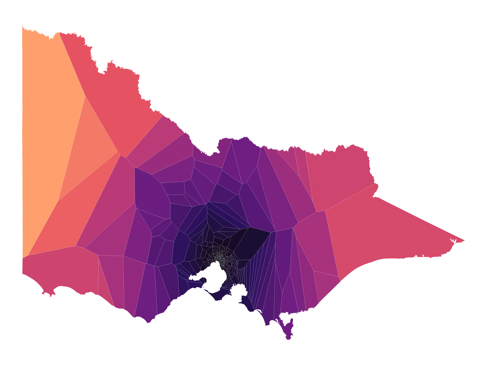
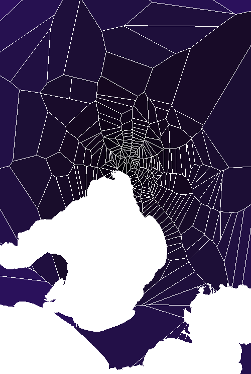

A [Voronoi diagram](https://en.wikipedia.org/wiki/Voronoi_diagram) separates a plane into regions where each area is closer to the seed point than to any other seed. In this example, we use railway stations across Victoria, Australia as the seed points, and generate the Voroni diagram outlined by the state boundary.

The first dataset we use is the shapefile which contains the polygon of the state of Victora's main boundary.

```{r}
suppressMessages(suppressWarnings(library(ggplot2)))
suppressMessages(suppressWarnings(library(ggvoronoi)))
suppressMessages(suppressWarnings(library(shapefiles)))
suppressMessages(suppressWarnings(library(dplyr)))
newproj <- "+proj=utm +zone=55 +south +units=m +ellps=WGS84"
vic.shp <- read.shp("../../../datasets/voroni_diagram/vic_state_boundary.shp")
#convert to a simple data frame
vic.shp <- convert.to.simple(vic.shp) %>% as.data.frame()

#find polygon with most points (main landmass)
x <- 0
y <- 0
for (i in 1:max(vic.shp$Id)) {if (y < nrow(vic.shp[vic.shp$Id==i,])) {x <- i;y <- nrow(vic.shp[vic.shp$Id==i,])}}
vic.shp <- vic.shp[vic.shp$Id==x,]

head(vic.shp)
```

Next we load a dataset containing coordinates of all train stations within Victoria.

```{r}
victrain.shp <- read.shp("../../../datasets/voroni_diagram/vic_train_stations.shp")
#convert to a simple data frame
victrain.shp <- convert.to.simple(victrain.shp) %>% as.data.frame()
victrain.shp <- victrain.shp[!duplicated(victrain.shp[,2:3]),]
head(victrain.shp)
```

Finally we generate our map using ggplot and ggvoronoi.

```{r}
town_hall <- c(-37.815064, 144.966909)

victrain.shp <- victrain.shp %>%
    mutate(dist_from_townhall = 
             sqrt((X-town_hall[2])^2 + (Y-town_hall[1])^2))

plotVoronoi <- victrain.shp %>% 
  ggplot(aes(x=X, y=Y)) +
  theme_void(base_family="Arial") +
  geom_voronoi(aes(fill=dist_from_townhall),size=0.01,color="#ffffff", 
               outline=vic.shp[,2:3]) + ## this outline feature is awesome!
  coord_quickmap() +
  scale_fill_viridis_c(end=0.8, option="magma", guide="none")

ggsave(".\\figure-html\\victoria.png",width=12,height=9,dpi=400)
```



And a close up of Melbourne:


